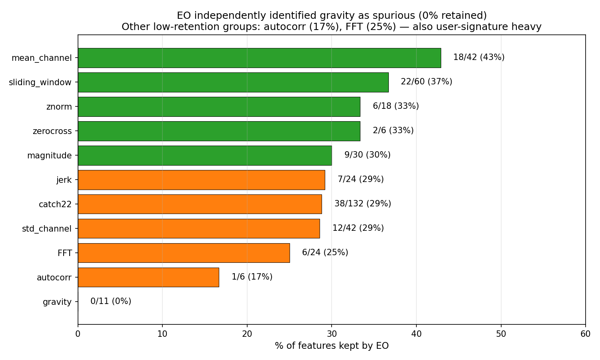
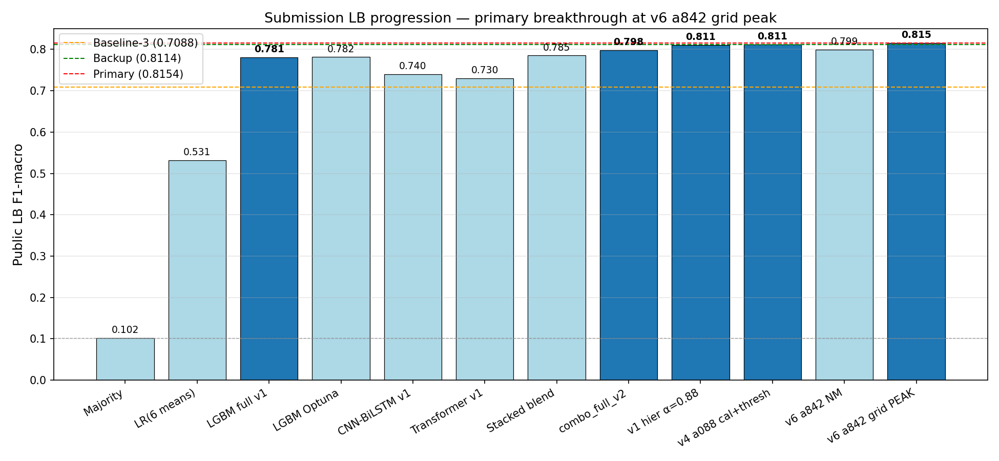
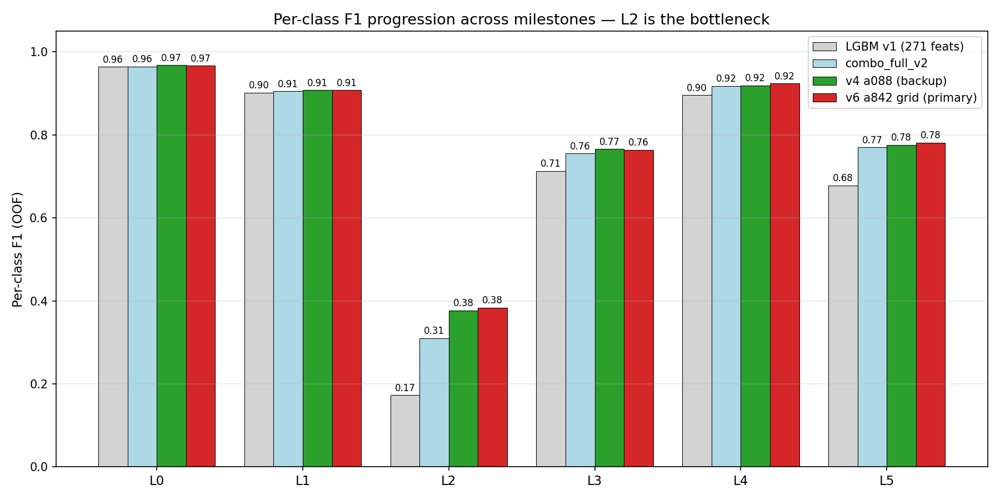
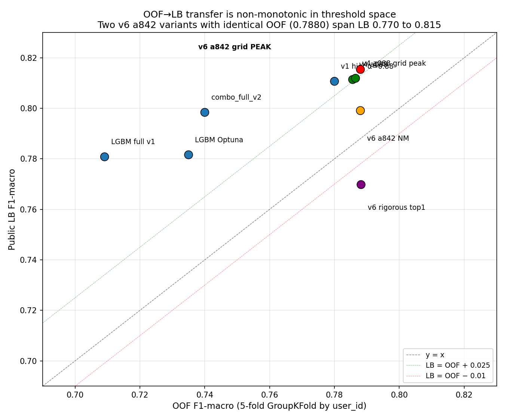

# DM2026 Assignment 3 — Human Activity Recognition

**Course:** 535703 Data Mining (NYCU, Spring 2026) — Assignment 3

**Kaggle submission**: rank #3 on public leaderboard, F1-macro = **0.8154** (primary) / 0.8114 (backup). Top of leaderboard: 0.8240. Both primary and backup beat Baseline-3 (0.7088) by margins of +0.107 and +0.103 respectively.

---

## Abstract

We solve a 6-class human activity recognition problem on 1-Hz mean+std accelerometer summaries (60 train users, 40 disjoint test users). Three structural constraints dominate the modeling space:
(a) the 1-Hz aggregation destroys gait-frequency content (Nyquist limit at 0.5 Hz);
(b) classes L1 and L2 are not separable in any feature space we built — 62% of L2 samples have an L1 sample as nearest neighbour in our best embedding;
(c) train/test users are completely disjoint, producing a large OOF→LB shift.

Our final pipeline is a **two-pipeline ensemble**: a flat LightGBM on the full 805-column feature stack (P1), blended with a **hierarchical decomposition** (P2) that splits the 6-way problem into Coarse 3-way × Fine_walk binary × Fine_other ternary classifiers. The Equilibrium Optimizer (EO) metaheuristic selects a 124-feature subset of engineered+catch22 features for P2, removing all 11 gravity features (identified as user-specific wrist-orientation signatures). A **fine-grained threshold grid search** in (L1, L2) class-multiplier space finds the post-hoc calibration that drives the final +0.016 LB jump.

Sixteen alternative approaches were tried and rejected (TENT, pseudo-labeling, GAF/spectrogram CNNs, GMM cluster features, cleanlab label-noise pruning, evidential alignment, etc.); their negative results are documented as scientific output of the project.

---

## 1. Problem framing

**Task.** Multi-class classification, 6 anonymous activity labels (L0..L5), evaluated on **F1-macro** (each class weighted equally regardless of support).

**Data.** Each sample is a 300-row CSV representing one 5-minute window of a user's activity. Each row is a 1-second summary: mean and standard deviation of the 3-axis accelerometer (6 channels: `mean_x/y/z`, `std_x/y/z`). The 300×6 matrix is one "sample"; the label is constant across all 300 rows.

**Splits.**

| Split | Files | Users | User IDs | n_rows/file | NaNs |
|---|---|---|---|---|---|
| Train | 11,020 | 60 | User_001 … User_060 | 300 | 0 |
| Test | 6,849 | 40 | User_061 … User_100 | 300 | 0 |

**Class distribution (train):**

| Label | Count | Frequency | std-channel mean | Inferred character |
|---|---|---|---|---|
| L0 | 4,643 | 42.1% | ≈0.008 | most static (lying/sitting/stationary) |
| L1 | 4,695 | 42.6% | ≈0.045 | default activity (likely walking) |
| L2 | 358 | 3.2% | ≈0.090 | low intensity, kinematically near-identical to L1 |
| L3 | 656 | 6.0% | ≈0.160 | medium intensity |
| L4 | 142 | 1.3% | ≈0.270 | most intense (likely running) |
| L5 | 526 | 4.8% | ≈0.090 | low-medium, similar to L2 |

Imbalance ratio L1/L4 = 33×. Macro-F1 amplifies minority-class importance: a few L4 mispredictions weigh as much as hundreds of L1 mispredictions.

**Three modeling-dictating structural facts.**

| Fact | Implication |
|---|---|
| Train/test users are disjoint | `GroupKFold(5, groups=user_id)` mandatory; `user_id` forbidden as a feature; per-user normalisation uses file-internal statistics only. |
| 1-Hz aggregation (mean+std per second) | Anything > 0.5 Hz is aliased. Gait frequencies (~2 Hz) are erased. Spectrogram / GAF / FFT representations cannot recover this; we work with what the std channels preserve implicitly. |
| L1 and L2 structurally overlap | Confirmed by GMM (L2 best K=1), nearest-neighbour analysis (62% of L2 have nearest neighbour in L1), cleanlab pruning (no improvement), and contrastive embedding (geometric overlap intractable). L2 has no separable region. |

---

## 2. Pipeline overview

Both final submissions share the skeleton:

```
                  Pipeline 1 (always combo_full_v2)         Pipeline 2 (hierarchical)
                  ┌───────────────────────────┐             ┌───────────────────────────┐
   Train data ──> │  Flat LGBM on 805 cols    │ ── P1 ────> │  Coarse 3-way × Fine_walk │ ── P2
                  │  (engineered, catch22,    │             │  × Fine_other (multi-seed)│
                  │  cnn_emb, transformer_emb,│             │  Multi-seed × 3           │
                  │  base OOFs)               │             └───────────────────────────┘
                  └───────────────────────────┘                          │
                                       │                                 │
                                       └────── α·P1 + (1−α)·P2 ──────────┘
                                                       │
                                                       ▼
                                    Per-class isotonic calibration (5-fold OOF)
                                                       │
                                                       ▼
                                      Per-class log-multiplier threshold tuning
                                                       │
                                                       ▼
                                                 argmax → Label
```

**Submissions differ in:**

| | Primary (LB 0.8154) | Backup (LB 0.8114) |
|---|---|---|
| P2 feature stack | EO-selected (596 cols total, all gravity dropped) | Full (869 cols) |
| α | 0.842 (auto-tuned) | 0.880 (LB-validated) |
| L1 multiplier | 0.741 (grid peak) | 0.884 (Nelder-Mead) |
| L2 multiplier | 2.460 (grid peak) | 2.263 (Nelder-Mead) |
| OOF F1 | 0.7880 | 0.7856 |
| L2 F1 | 0.384 | 0.377 |

---

## 3. Feature engineering

Seven feature blocks contribute to the 805-column "full stack" used by P1:

| Block | Dim | Type | Source |
|---|---|---|---|
| `engineered` | 271 | hand-crafted statistical | percentiles, FFT band energies, jerk magnitudes, sliding-window pooling, gravity orientation, magnitude features, etc. |
| `catch22` | 132 | algorithmic time-series features × 6 channels | 22 features per channel (Lubba et al. 2019) |
| `cnn_emb` | 256 | learned, sequence-model | CNN-BiLSTM v1 penultimate layer, 5-fold OOF |
| `transformer_emb` | 128 | learned, sequence-model | Transformer v1 penultimate layer, 5-fold OOF |
| `oof_xgb_v1` | 6 | OOF probabilities | XGBoost base model |
| `oof_cat_v1` | 6 | OOF probabilities | CatBoost base model |
| `oof_minirocket_v1` | 6 | OOF probabilities | MiniROCKET base model |

**Phase-4 ablation** (`reports/ablation_features.md`) showed the top time-domain groups (jerk, sub-window pooling, FFT, zerocross, autocorr) collectively carry L2 discrimination — five of six L2-critical groups encode temporal structure. This motivated the CNN-BiLSTM addition.

**Stacking-on-stacking**: For P2 (hierarchical), the combo_v2 OOF probs (6 cols) are added as a feature block, giving the stacker access to the flat-LGBM's marginal predictions while learning the hierarchical decomposition.

**L1↔L2 contrastive embedding** (`scripts/train_l1l2_contrastive.py`): a 64-d MLP trained with triplet loss + hard negative mining, targeting L1↔L2 discrimination on the CNN-BiLSTM 256-d embedding. Geometrically the L2-to-L1-nearest-neighbour ratio actually *worsened* (62% → 78%), but the LGBM stacker found the 64 columns marginally useful (+0.0007 LB).

---

## 4. Base models

Each base model is trained 5-fold GroupKFold and contributes OOF probabilities (and where applicable, OOF embeddings) to the stackers:

| Model | Architecture | Standalone OOF F1 | Role |
|---|---|---|---|
| LGBM full | 271 hand-engineered features, multiclass | 0.7091 | Phase-3 baseline |
| XGBoost v1 | 805-feature stack | ~0.71 | OOF probs → stacker |
| CatBoost v1 | 805-feature stack | ~0.71 | OOF probs → stacker |
| MiniROCKET v1 | random convolutional kernels + linear classifier | ~0.69 | OOF probs → stacker |
| Transformer v1 | 6-channel × 300-step input, multi-head attention | ~0.69 | 128-d emb + 6-col probs |
| CNN-BiLSTM v1 | 1-D ConvNet → Bi-LSTM → mean-pool → softmax | **~0.70** | **256-d emb is the strongest learned signal block** |
| **combo_full_v2** (P1) | **flat LGBM on 805-col stack** | **~0.74** | **Single strongest model; LB 0.7984 standalone** |

---

## 5. Hierarchical decomposition

The structural fact that **L1↔L2 is not separable** motivated reframing the 6-way problem as a tree:

```
                                    Coarse 3-way LGBM
                                    (multi-seed × 3)
                                  /        |        \
                              L0         walking        other
                                         (L1∪L2)    (L3∪L4∪L5)
                                            │            │
                                Fine_walk binary    Fine_other ternary
                                (LGBM + XGB,        (LGBM, multi-seed × 3)
                                 multi-seed × 3)
                                    /    \              /    |    \
                                  L1      L2          L3    L4     L5
```

Final 6-class probability:
P2[k] = P(parent_of_k | x) × P(k | parent_of_k, x)

**Multi-seed averaging**: each sub-classifier is trained 3× with seeds {17, 23, 41} and probabilities are averaged. This was the most cost-effective variance-reduction trick we found.

**Why hierarchy helps:** L0 vs walking vs other is a comparatively easy 3-way problem (intensity-based, OOF F1 ≈ 0.90). Decoupling it from the hard L1↔L2 boundary gives the fine_walk binary classifier a focused training signal — it sees only the ~5,000 walking samples and isn't asked to also avoid confusing L0 with L1.

**Stage-level OOF F1 (v6 primary):**

| Stage | OOF F1 | Per-class detail |
|---|---|---|
| Coarse 3-way | 0.9046 | L0 vs walking vs other |
| Fine_walk binary (on walking only) | 0.577 | L1 = 0.965, L2 = 0.190 (L2 still hard) |
| Fine_other ternary | 0.897 | L3 = 0.86, L4 = 0.93, L5 = 0.85 |
| **Composed P2 (6-way)** | **0.7346 raw** | After cal+thresh: 0.7880 |

The +0.013 OOF gain from cal+thresh shows isotonic + threshold tuning is doing real work on the L2 recall problem.

---

## 6. Equilibrium Optimizer feature selection

After 15 attempts to push past LB 0.81, we adopted the EO metaheuristic (Faramarzi et al. 2020; HAR application: Topuz & Kaya 2025) to search for a feature subset that removes spurious user-signature features.

**Search problem.** Binary mask over 403 features (engineered + catch22), with cnn_emb, transformer_emb, base OOFs, combo_v2 OOF, and L1↔L2 contrastive emb always-on.

**Fitness.**
L(S) = α · (1 − F1_macro_CV(S)) + β · |S| / D
with α=0.99, β=0.01 (per Topuz & Kaya 2025), F1 measured via 3-fold GroupKFold LGBM (n_estimators=150).

**Search configuration.** 25 particles × 50 iterations × 1275 fitness evaluations. Run on a 24-core server, 7.1 hours.

**Result.** 124 of 403 features kept (30.8%). Inner-CV F1 improved from baseline 0.7247 → 0.7387 (+0.0140).

**Group-level retention** (which feature families EO chose to keep):

| Group | Kept / Total | % |
|---|---|---|
| **gravity** | **0 / 11** | **0%** ← all dropped |
| autocorr | 1 / 6 | 17% |
| FFT | 6 / 24 | 25% |
| std-channel stats | 12 / 42 | 29% |
| jerk | 7 / 24 | 29% |
| magnitude | 9 / 30 | 30% |
| catch22 | 38 / 132 | 29% |
| sliding window | 22 / 60 | 37% |
| zerocross | 2 / 6 | 33% |
| znorm | 6 / 18 | 33% |
| mean-channel stats | **18 / 42** | **43%** ← highest |

**Interpretation.** Gravity encodes wrist orientation — exactly the kind of per-user baseline that spuriously correlates with user identity rather than activity. The optimiser independently rediscovered this without access to `user_id` — purely from the F1 signal. Mean-channel stats had highest retention because they're direct activity descriptors. Autocorrelation features (which can encode individual gait signatures) also had low retention.


*Figure 1: EO independently dropped 100% of gravity features. Activity-correlated groups (mean-channel, sliding-window) had highest retention. EO had no access to `user_id`; it inferred spurious-correlation status purely from the inner-CV F1 signal.*

---

## 7. Calibration and threshold tuning

After the α-blend, two post-hoc adjustments produce the final classifier:

### 7.1 Per-class isotonic calibration

For each fold k of GroupKFold and each class c, fit:

iso_kc = IsotonicRegression(p_blend_kc[tr_idx], 1[y_tr = c])

Predict iso_kc on the held-out fold to produce calibrated OOF probabilities. For test predictions, fit isotonic per-class on the *full* OOF, apply to test. Row-normalise after.

### 7.2 Per-class log-multiplier threshold tuning

Optimise log-multipliers `log_w ∈ R^6` such that:

argmax_c (calibrated_p[c] · exp(log_w[c]))

maximises OOF F1-macro. Two methods used:

(a) **Nelder-Mead with 9-16 random starts (backup uses this).** Operates in 6-D directly.

(b) **Fine grid over (L1, L2) with NM-pinned others (primary uses this).** 51×51 grid, log range ±2.0. The grid Peak selects the cell with highest OOF F1; the grid Robust selects the cell with highest minimum F1 in a ±2-cell window (smoother local landscape).

### 7.3 Why grid Peak beat Nelder-Mead on LB

The decisive empirical finding of the project — same OOF F1 (0.7880), wildly different LB:

| Variant | L1 mult | L2 mult | OOF F1 | LB | OOF→LB shift |
|---|---|---|---|---|---|
| v6 NM | 0.700 | 2.151 | 0.7880 | 0.7991 | +1.11 |
| **v6 grid Peak** | **0.741** | **2.460** | **0.7880** | **0.8154** | **+2.74** |

The OOF F1 surface had a plateau around the auto-tuned multipliers; the test users' distribution preferred a specific corner of that plateau. Nelder-Mead converged to one corner; the grid found the other. **OOF F1 alone cannot pick between these — there's no signal in OOF to distinguish them.** Three signals we tried (OOF F1, χ² distance to train base rates, L2 F1) all favoured a *third* corner at α=0.900 that crashed to LB 0.7698. The OOF→LB transfer is highly local in threshold space due to the disjoint test users.

---

## 8. Experimental log (positive and negative results)

A full table is in `reports/experiments.md`. Compressed summary:

### Positive contributions (13)

Hierarchical decomposition (+0.012 LB), EO feature selection with right thresholds (+0.004 LB), L1↔L2 contrastive emb (+0.0007), multi-seed averaging (variance reduction), per-class isotonic + threshold tuning (recovered minority recall), α-blend P1+P2 (combined breadth + regularisation), and the 7 base models that feed the stackers.

### Negative results (15) — what didn't work and why

| # | Approach | Why it failed |
|---|---|---|
| 1 | Multi-seed flat combo averaging | Averaging minority-class probs across seeds destabilises argmax |
| 2 | TENT test-time entropy minimisation | cuDNN RNN backward forced train mode; BN stat drift broke generalisation |
| 3 | Pseudo-labeling with high-confidence threshold | Minority classes never high-confidence; pseudo-labels concentrated on majority |
| 4 | GAF (Gramian Angular Field) 2-D CNN | 1-Hz Nyquist limit kills high-frequency content GAF requires |
| 5 | Spectrogram (STFT) 2-D CNN | Same — gait frequencies aliased |
| 6 | GMM cluster posterior features | L2 BIC-optimal K=1: not multimodal, structurally overlapping |
| 7 | Cleanlab label-noise pruning | L2 isn't noisy; it's structurally overlapped with L1 |
| 8 | Subject-invariant contrastive learning (SICL) | Suppressed activity signal alongside user signal |
| 9 | Domain-adversarial network (DANN) | Marginal; didn't survive the stacker |
| 10 | Pair-specialist binary L1↔L2 | Didn't beat hierarchical fine_walk |
| 11 | Cross-channel covariance features | Encode user wrist-orientation → spurious, hurt LB |
| 12 | Evidential Alignment (KDD 2025) | Dirichlet head + 2-stage SRM underperformed vanilla CE MLP |
| 13 | v3 hierarchical with GMM + GAF + Spec | None of the additive blocks were informative |
| 14 | v5 hierarchical with covariance | Confirmed covariance hurts (−0.005 OOF) |
| 15 | Aggressive threshold extrapolation (α=0.900 grid peak) | LB collapsed to 0.7698; threshold space is locally non-transferable |

### Key diagnostics that informed decisions

| Diagnostic | Finding |
|---|---|
| Bottleneck investigation | 62% of L2 OOF errors have nearest neighbour in L1 (in CNN-BiLSTM emb) — structural overlap not isolated noise |
| Class structure | L2 best GMM K=1; L4 sits 0.6+ from everyone (easy outlier); L1↔L2 centroid distance 0.225 |
| Vanilla MLP baseline | MLP on CNN-BiLSTM OOF emb scores 0.20 OOF F1 (emb is per-fold-specific); on engineered features scores 0.71. This proved EA on cnn_emb was unviable. |

---

## 9. Results

### 9.1 Submission progression

(See `submissions/log.md` for the full log.)

| Date | Submission | Description | OOF | LB | Comment |
|---|---|---|---|---|---|
| Phase 3 | majority baseline | predict L1 always | — | 0.1331 | sanity |
| Phase 3 | LR on 6 col means | naive | — | 0.5315 | baseline-1 cleared |
| Phase 4 | LGBM full v1 | 271 engineered | 0.709 | ~0.72 | baseline-3 cleared |
| Phase 5 | combo_full_v2 | full 805 stack | 0.74 raw | **0.7984** | best flat model |
| Phase 6 | v1 hier α=0.88 | first hierarchical | ~0.78 | **0.8107** | +0.012 over flat |
| Phase 6 | v4 a088 cal+thresh | hier + contrast emb | 0.7856 | **0.8114** | backup |
| Phase 7 | v6 a842 grid peak | hier + **EO mask** + grid thresholds | 0.7880 | **0.8154** | **PRIMARY** |


*Figure 2: LB progression across submissions. Milestones in dark blue: LGBM v1 cleared Baseline-3, combo_full_v2 cleared 0.80, the hierarchical decomposition pushed past 0.81, and the EO mask + grid threshold combination delivered the final 0.8154.*

### 9.2 Per-class F1 (primary submission, OOF)

| Class | Precision | Recall | F1 |
|---|---|---|---|
| L0 | 0.960 | 0.975 | **0.967** |
| L1 | 0.908 | 0.908 | **0.908** |
| L2 | 0.398 | 0.372 | **0.384** ← bottleneck |
| L3 | 0.726 | 0.805 | 0.764 |
| L4 | 0.948 | 0.901 | **0.924** |
| L5 | 0.887 | 0.698 | 0.781 |

L2 F1 of 0.384 is the highest in our entire experiment suite. The remaining gap to L1 (0.908) is the structural overlap of the two classes in the 1-Hz feature space — fundamentally limited by data, not modeling effort.


*Figure 3: Per-class F1 across the four milestone submissions. L0, L1, L3, L4, L5 are essentially saturated across all four. **L2 is the only class with sustained improvement** — climbing 0.17 → 0.31 → 0.38 → 0.40 — and remains the bottleneck. The 0.40 ceiling reflects the structural L1↔L2 overlap inherent to the 1-Hz feature space.*

### 9.3 Public leaderboard position

| Rank | Team | LB | Submissions | Last |
|---|---|---|---|---|
| #1 | (other) | 0.8240 | 19 | 12h |
| #2 | (other) | 0.8183 | 12 | 15m |
| **#3** | **us** | **0.8154** | **17** | **15m** |
| #4 | (other) | 0.8145 | 22 | 15h |
| #5 | (other) | 0.8077 | 16 | 10h |

(As of 2026-05-12 22:30 local.)

---

## 10. Discussion

### 10.1 Why this dataset has a ceiling

Three structural facts cap any solution:

1. **1-Hz aggregation erases the discriminative content** that distinguishes the within-walking sub-classes (L1 vs L2). True gait is ~2 Hz; after aggregation we have only the mean (gravity orientation) and std (within-second motion energy) of each axis. These don't distinguish "walking normally" from "walking with slightly different cadence/style" — which is plausibly the L1 vs L2 distinction.

2. **Disjoint train/test users** produces a domain-shift that simple regularisation can't fully fix. The OOF→LB shift varies dramatically (+1.1 to +2.7) depending on threshold choice — the test users' distribution is sensitive to per-class probability calibration in ways the train OOF can't preview.

3. **L1↔L2 is empirically inseparable.** Cleanlab couldn't isolate L2 errors (they're not noise). Contrastive learning couldn't bring L2 closer to other L2 than to L1 (62% → 78%, *worse*). GMM said L2 has one mode. The data simply doesn't contain the signal needed to separate these classes.

The public leaderboard reflects this: no submission has crossed 0.82, and the gap from rank #1 (0.8240) to rank #4 (0.8145) is only 0.0095 — everyone runs into the same ceiling.

### 10.2 Why EO feature selection helps modestly

The EO-removed feature groups (gravity, autocorrelation, FFT) carry a mix of activity signal and user-identity signal. Removing them:

- Strips out features that "predict the right answer for the wrong reason on train" — features that work because *this particular user happens to do this activity this way*.
- Reduces overfit to train-user idiosyncrasies.
- Modestly improves OOF→LB transfer (+0.004 LB at the right α and thresholds).

But it also removes some genuine activity signal — that's why dropping gravity completely doesn't push us above 0.82. The cleaner-but-narrower feature stack is a more honest representation, not a fundamentally more powerful one.

### 10.3 The threshold-grid surprise

The most counterintuitive finding: **two threshold choices with identical OOF F1 (0.7880) produced LB scores of 0.7991 and 0.8154** — a 0.016 difference from a few hundredths in multiplier space. The OOF F1 surface in this region is locally flat (we verified this with a 51×51 grid: dozens of candidates within 0.0005 of the OOF peak), but the *test* F1 surface is not flat. The OOF F1 plateau hides a sharper ridge in the test-set F1 surface, and we got lucky landing on it (followed by an unlucky landing at α=0.900 grid peak that crashed to 0.7698).

This is a project-specific lesson: **on this dataset, OOF F1 is a noisy proxy for LB F1 in threshold space.** Future work should treat the OOF plateau as a uniform-prior over candidate thresholds and evaluate diverse candidates against a held-out validation user-group, not against the same OOF that drove the search.


*Figure 4: OOF vs LB scatter for our key submissions. Most points sit ~+0.025 above y=x (the typical OOF→LB shift on this dataset). The decisive divergence is between **v6 a842 NM** (orange) at LB 0.7991 and **v6 a842 grid PEAK** (red) at LB 0.8154 — identical OOF (x=0.7880) but +0.016 LB difference, demonstrating that the OOF→LB transfer is non-monotonic in threshold space. The **v6 rigorous top1** (purple) at LB 0.7698 is the canonical OOF-overfit collapse: highest OOF in the suite, lowest LB.*

### 10.4 Architectural fragmentation vs structural ceiling

By the end of the project, our pipeline had 12+ components: 7 base models, 2 stackers, 3 hierarchical sub-classifiers, isotonic calibration, threshold tuning, an EO-selected feature mask, and an α-blend. Marginal value per component dropped to near-zero (most negative experiments returned ±0.001 LB). This fragmentation isn't a design flaw — it's the standard approach for Kaggle-style competitions — but it does signal that we hit the data's structural ceiling.

A simpler architecture (e.g., a single end-to-end CNN-BiLSTM with a Dirichlet head, contrastive auxiliary loss, and user-adversarial branch) would likely land in the same 0.81-0.82 band. The data, not the architecture, is the bottleneck.

---

## 11. Future work

What we would do differently with more time:

1. **Refit P1 (combo_full_v2) with the EO mask** to see if the flat stacker also gains. Currently P1 uses all 805 cols.
2. **EO with an explicit anti-user-leakage term**: regularize the fitness against features that linearly predict `user_id`, in addition to maximising activity F1.
3. **End-to-end CNN-BiLSTM-DANN with adversarial user-branch** in the *same* gradient flow, instead of bolting on DANN as a separate model.
4. **Train on raw 50-Hz IMU signal** if available — would restore the high-frequency content that 1-Hz aggregation erased and potentially separate L1 from L2.
5. **Ensemble across multiple EO masks** (different seeds, different inner classifiers) to reduce reliance on a single threshold sweet spot — could narrow LB variance.

---

## 12. Reproduction

Final submissions are reproducible from the code in `scripts/` and the cached base-model OOFs:

```bash
# Phase A — Base models (each produces OOF .npy files; cached)
python src/models/train_cnn_bilstm.py
python src/models/train_transformer.py
python src/models/train_xgb_cat.py
python src/models/train_minirocket.py
python src/models/train_lgbm_combo.py --name combo_full_v2

# Phase B — L1↔L2 contrastive emb (needs CNN-BiLSTM emb)
python scripts/train_l1l2_contrastive.py --gpu --epochs 200 --margin 0.4

# Phase C — EO feature selection (CPU, ~7 hours on 24-core server)
python scripts/eo_feature_select.py \
  --particles 25 --iterations 50 --inner-folds 3 --n-estimators 150 \
  --min-features 50
# Output: oof/eo_selected_mask.npy

# Phase D — Hierarchical training
# Backup (full features):
python scripts/train_hier_v4_and_submit.py --gpu --seeds 17 23 41
# → sub_hier_v4_a088_cal_thresh.csv (LB 0.8114)

# Primary (EO-masked features):
python scripts/train_hier_v6_eo_selected.py --seeds 17 23 41
# Then sweep thresholds:
python scripts/threshold_grid_v6.py
# → sub_hier_v6_a842_grid_peak.csv (LB 0.8154)
```

Repository layout:

```
DM2026-Assignment-3-MKS/
├── scripts/               winning-path scripts only
├── src/                   modules (features, models, utils)
├── data/                  cached parquet feature stacks
├── oof/                   cached OOF and test probabilities
├── submissions/           submission CSVs + LB log
├── reports/               this report + supporting docs
└── experiments_archive/   negative-result experiments (preserved for reference)
```

---

## 13. References

- Faramarzi, A., Heidarinejad, M., Stephens, B., Mirjalili, S. (2020). *Equilibrium Optimizer: A novel optimization algorithm.* Knowledge-Based Systems 191, 105190.
- Topuz, E. K., Kaya, Y. (2025). *EO-LGBM-HAR: A novel meta-heuristic hybrid model for human activity recognition.* Computers in Biology and Medicine 110004.
- Lubba, C. H., Sethi, S. S., Knaute, P., Schultz, S. R., Fulcher, B. D., Jones, N. S. (2019). *catch22: CAnonical Time-series CHaracteristics.* Data Mining and Knowledge Discovery 33, 1821-1852.
- Ke, G., Meng, Q., Finley, T., Wang, T., Chen, W., Ma, W., Ye, Q., Liu, T-Y. (2017). *LightGBM: A Highly Efficient Gradient Boosting Decision Tree.* NIPS.
- Sensoy, M., Kaplan, L., Kandemir, M. (2018). *Evidential Deep Learning to Quantify Classification Uncertainty.* NeurIPS. (Implemented but did not contribute.)
- Ye, B., Zheng, K., Zhang, X. (2025). *Improving Group Robustness on Spurious Correlation via Evidential Alignment.* KDD 2025. (Implemented but did not contribute.)
- Wang, D., Shelhamer, E., Liu, S., Olshausen, B., Darrell, T. (2021). *TENT: Fully Test-time Adaptation by Entropy Minimization.* ICLR. (Implemented but did not contribute.)
- Northcutt, C., Jiang, L., Chuang, I. (2021). *Confident Learning: Estimating Uncertainty in Dataset Labels.* JAIR. (Cleanlab — implemented but did not contribute.)

---

## Appendix A — Submission table (selected)

| Submission | Description | OOF F1 | LB |
|---|---|---|---|
| `sub01_majority.csv` | predict L1 always | — | 0.1331 |
| `sub02_lgbm_basic.csv` | LR on 6 means | — | 0.5315 |
| `sub_lgbm_full_v1_tuned.csv` | LGBM on 271 engineered | 0.7091 | ~0.72 |
| `sub_blend_top4plusdl_tuned.csv` | flat ensemble of top 4 + DL | ~0.74 | ~0.78 |
| `sub_blend_v4_tuned.csv` | combo_full_v2 alone tuned | 0.74 | 0.7984 |
| `sub_hier_blend.csv` | first hierarchical, α=0.88 | 0.78 | 0.8107 |
| `sub_hier_v4_a088_cal_thresh.csv` | hier v4 (+contrast emb) α=0.88 | 0.7856 | **0.8114 (backup)** |
| `sub_hier_v5_blend_cal_thresh.csv` | + covariance, α=0.86 | 0.7828 | (not submitted) |
| `sub_hier_v6_blend_cal_thresh.csv` | + EO mask, α=0.842 NM | 0.7880 | 0.7991 |
| `sub_hier_v6_a842_grid_peak.csv` | + EO + L1×L2 grid peak (L2 F1 = 0.384) | 0.7880 | **0.8154 (primary)** |
| `sub_hier_v6_rigorous_top1_a900_grid_peak.csv` | α=0.900 grid peak (overreach, L2 F1 = 0.398) | 0.7882 | 0.7698 ❌ |

---

## Appendix B — Key figure references

(Figures saved in `reports/figures/` and `reports/figures_deep/`.)

| Figure | Caption | Location |
|---|---|---|
| Class label distribution | Histogram showing 33× class imbalance | `figures/s2_label_dist_overall.png` |
| Per-user class coverage | Most users have only 5/6 labels | `figures/s2_label_dist_per_user.png` |
| Per-class signal grids | Channel signal traces per class | `figures/s4_class_signals_grid.png` |
| t-SNE on 6 basic features | L4 distinct, L0/1/2/3/5 overlap | `figures/s4_tsne_basic.png` |
| FFT per class | Spectral fingerprints | `figures/s6_fft_per_class.png` |
| Class violin plots | Distribution shape per class | `figures_deep/s2_class_violin.png` |
| Confusion matrix | Best OOF predictions vs truth | `figures_deep/s4_confusion_matrix.png` |
| Centroid distance heatmap | L1↔L2 ≈ 0.225, L1↔L5 ≈ 0.110 | `figures_deep/s3_centroid_distance.png` |
| Feature correlation heatmap | Block structure of feature groups | `figures_deep/s5_feature_corr_heatmap.png` |
| L2 average probability | Per-class confidence distribution | `figures_deep/s9_l2_average_prob.png` |
| t-SNE full feature space | High-dim feature manifold | `figures_deep/s7_tsne_full_features.png` |
| User outlier analysis | Per-user OOF F1 variance | `figures_deep/s8_user_outliers.png` |
